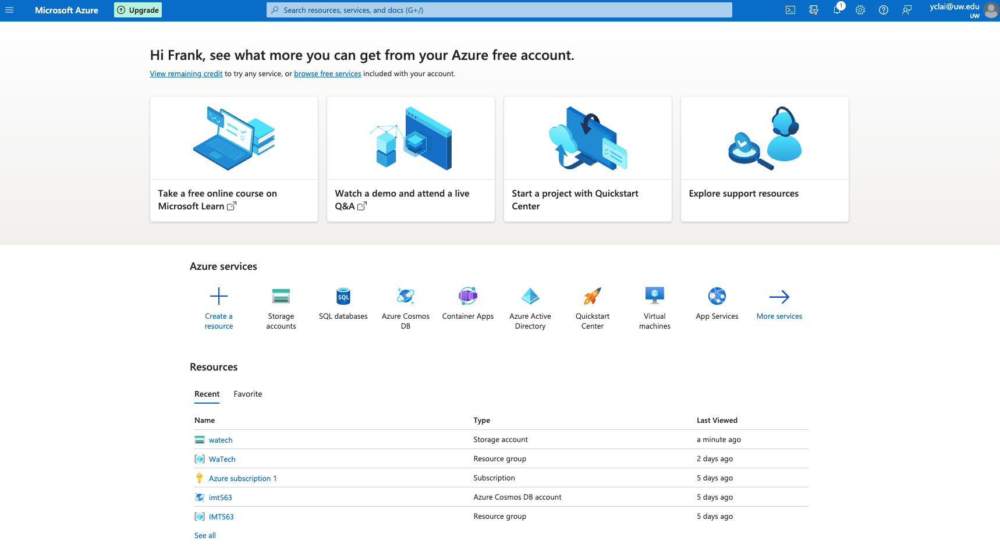
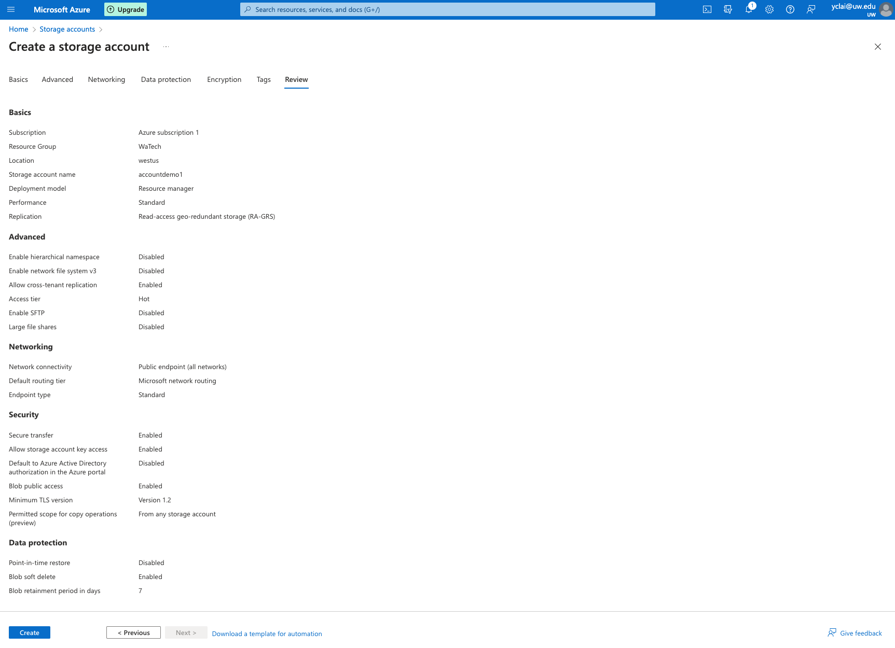
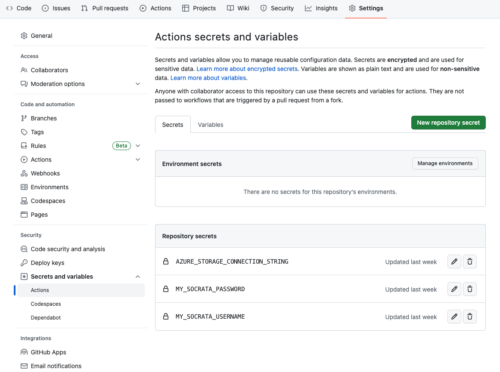
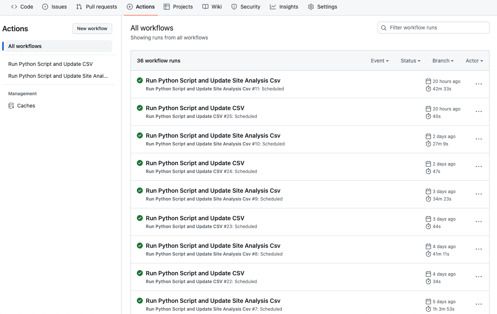
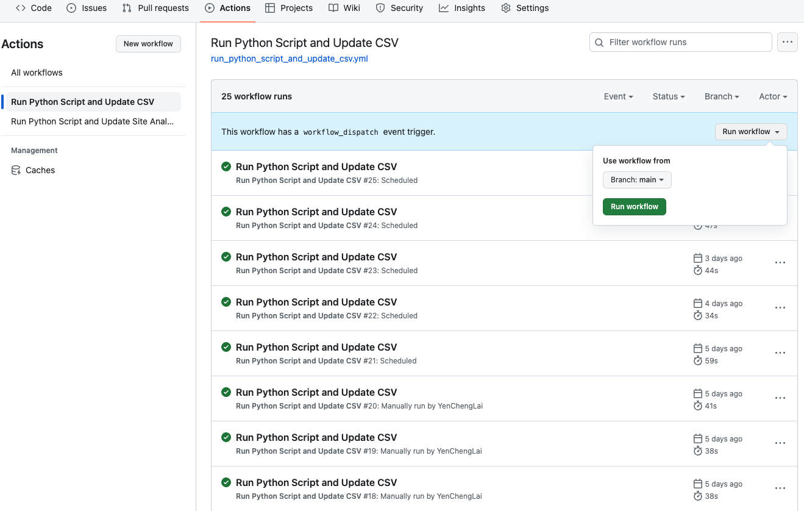
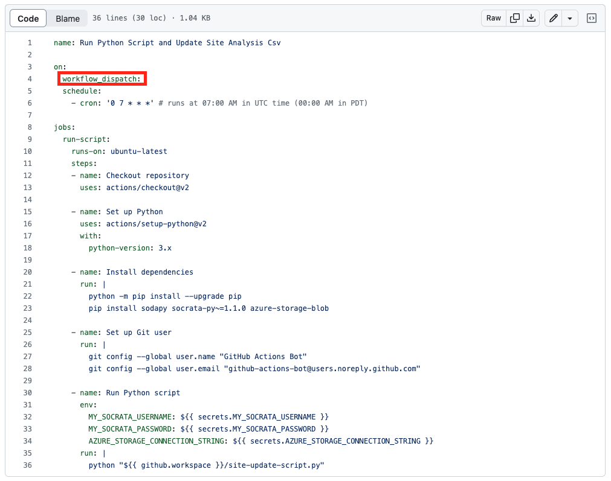

# Data Pipeline Setup
## _Explanation and Walkthrough_

This Documentation will guide you on how to set up the automation pipeline to update dataset on [Data.wa](https://data.wa.gov/) utilizing:
- _**GitHub Action**_ as task scheduler
- _**Azure Cloud Storage**_ as data storage solution

## Flow Chart

1. Execute MetadataFromAPI.py to retrieve the latest Metadata and generate a file (MetadataFromAPI_py.xlsx) to Azure data storage.
2. Execute MetricVisualization.py, which will generate two new csv files (Metric3.csv and Metric4.csv).
3. Execute SiteAnalyticsCSV.py to merge data to the existing file (SiteAnalytics_AssetAccess_test.csv) in Azure.
4. Execute three update scripts to update the data corresponding to three datasets.

| File name | Corresponding Dataset | Corresponding Metrics Name |
| ----------| ----------------------| ---------------------------|
| Metric3.csv | Metadata for Assets on Open Data Portal | Number of assets hosted on data.wa.gov(Measure)   Number of datasets with visualizations(Metric)   Number of datasets with stories(Metric) |
| Metric4.csv | Open data portal access by category | Access of assets hosted on data.wa.gov& Most popular assets(Measure) |
| SiteAnalytics_AssetAccess_test.csv | Asset Access Data | Access of assets hosted on data.wa.gov& Most popular assets(Measure) |

## Setup

### Azure Data Storage
In order to create a Azure Data Storage, you will first need to have an Azure account for yourself. After you created and logged into the Azure platform Portal, here are the following steps to help you create your Azure Storage:

1. Login to Azure Portal:

Go to https://portal.azure.com/ and sign in with your Microsoft Azure account.

2. Create a Storage Account:

Once you've logged in, click on the "Create a resource" button located at the top left of the Azure Portal.
From there, you should see a search bar. Type in "Storage account" and select it from the dropdown.
On the "Storage account" page, click on the "Create" button to start creating your storage account.

3. Configure Your Storage Account:

Now, you'll need to fill in the details for your new storage account:
- Subscription: Choose the subscription under which you want to create the storage account.
- Resource group: You can create a new resource group or use an existing one. A resource group is a way to group together different Azure resources.
- Storage account name: Create a unique name for your storage account. This name must be unique across all existing Azure storage account names.
- Location: Choose the region where you want your storage account to be hosted.
- Performance: Choose between standard and premium. Standard storage uses magnetic drives and is best for most scenarios. Premium storage uses solid-state drives and is best for scenarios that require high transaction rates.
- Account kind: There are different kinds of storage accounts for different types of data, including BlobStorage, StorageV2, and more. StorageV2 is the most general-purpose storage account type.
- Replication: Choose how your data is replicated across Azure's infrastructure. Options include LRS (Locally redundant storage), GRS (Geo-redundant storage), RAGRS (Read-access geo-redundant storage), and ZRS (Zone-redundant storage).

If you don't want to specify the details, you can just use the default setting Azure provided. Remember to create or choose the resource group and storage account name. These two are mandetory in creating storage accounts.

4. Review and Create:

Review your settings and click "Create" to create your new storage account.

5. Access Keys:

Once your storage account is created, you can find your access keys by clicking on "Access keys" under the "Security + networking" section of your storage account page. You'll need these keys to authenticate your application or service with your storage account.

6. Create a container:

To store data in blob storage, you'll need to create a container. From your storage account page, click on "Containers" under the "Blob service" section, then click "+ Container" to create a new container.

_***The container name here will directly influence your execution result. Be sure to use the same container name in the script as the one you created.***_

### Credentials

| Name | Value |
| ------ | ------ |
| MY_SOCRATA_USERNAME | the username of the service account |
| MY_SOCRATA_PASSWORD | the password of the service account |
| AZURE_STORAGE_CONNECTION_STRING | the connection string retrieved from Azure service |

#### How to get your credentials:

***If your are going to create a service account to run the scripts, make sure it has enough permission to access the target datasets on Data.wa website***
1. MY_SOCRATA_USERNAME: this is the username of the service account
2. MY_SOCRATA_PASSWORD: this is the password of the service account
3. AZURE_STORAGE_CONNECTION_STRING: this is the access key under your Azure Storage Account

#### How to set your credentials in GitHub Repository:

1. In the GitHub Repository, click "Settings" tab 
2. Click "Secrets and variables" in the left sidebar
3. Choose "Actions" and add or edit the above-mentioned secrets

### How to trigger Automation Process:

1. In the GitHub Repository, click "Actions" tab. You will see all actions and execution results here.

2. You can choose a specific action at the left sidebar. If the action provide a manual trigger, it will be mentioned at this page, and you can trigger it by clicking "Run workflow"

3. If you want to add a manual trigger to a specific action, you can do it by adding "workflow_dispatch:" under the "on" section in the corresponding .yml file. Please keep in mind that you need to make sure the indentation, order, and colon are as stated as the below picture because it will affect the .yml compiling result.

