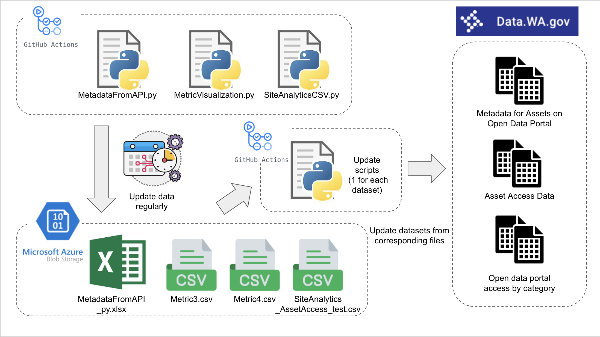

# Data Pipeline Setup
## _Explanation and Walkthrough_

This Documentation will guide you on how to set up the automation pipeline to update dataset on [Data.wa](https://data.wa.gov/) utilizing:
- _**GitHub Action**_ as task scheduler
- _**Azure Cloud Storage**_ as data storage solution

## Flow Chart

1. Execute MetadataFromAPI.py to retrieve the latest Metadata and generate a file (MetadataFromAPI_py.xlsx) to Azure data storage.
2. Execute MetricVisualization.py, which will generate two new csv files (Metric3.csv and Metric4.csv).
3. Execute SiteAnalyticsCSV.py to merge data to the existing file (SiteAnalytics_AssetAccess_test.csv) in Azure.
4. Execute three update scripts to update the data corresponding to three datasets.

| File name | Corresponding Dataset | Corresponding Metrics Name |
| ----------| ----------------------| ---------------------------|
| Metric3.csv | Metadata for Assets on Open Data Portal | Number of assets hosted on data.wa.gov(Measure)   Number of datasets with visualizations(Metric)   Number of datasets with stories(Metric) |
| Metric4.csv | Open data portal access by category | Access of assets hosted on data.wa.gov& Most popular assets(Measure) |
| SiteAnalytics_AssetAccess_test.csv | Asset Access Data | Access of assets hosted on data.wa.gov& Most popular assets(Measure) |

## Setup

### Credentials

| Name | Value |
| ------ | ------ |
| MY_SOCRATA_USERNAME | the username of the service account |
| MY_SOCRATA_PASSWORD | the password of the service account |
| AZURE_STORAGE_CONNECTION_STRING | the connection string retrieved from Azure service |

How to get your credentials:

***If your are going to create a service account to run the scripts, make sure it has enough permission to access the target datasets on Data.wa website***
1. MY_SOCRATA_USERNAME: this is the username of the service account
2. MY_SOCRATA_PASSWORD: this is the password of the service account
3. AZURE_STORAGE_CONNECTION_STRING: this is the access key under your Azure Storage Account

# Automation
Purpose: Automatically update data in the csv file to chosen dataset in Data.wa platform
Steps: 
- Set up your secret credentials in the repository
  - Go to ***Settings*** tab in the repo
  - Click ***Secrets and variables*** in the left sidebar
  - Click ***New repository secret*** green button to add new secret
    - put "MY_SOCRATA_USERNAME" in the ***Name*** field and put your username in the ***Secret*** field
    - put "MY_SOCRATA_PASSWORD" in the ***Name*** field and put your password in the ***Secret*** field
  - You can use other name, but make sure they are the same as listed in the ***update-script.py*** file
- Under the .github/workflows directory, you will see a YAML file (.yml) defining the automation parameters
  - on: defining the triggered time
    - workflow_dispatch: allowing the action to be triggered manually
    - schedule: defining the schedule (in UTC time)
  - jobs: you can define different jobs here. All jobs will be triggered in this action.
    - Checkout repository: clone the repository in the runner's environment
    - Set up Python: install specific Python version
    - Install dependencies: install necessary lib, including update Python and install socrata lib
    - Set up Git user: sets the global Git user name and email to be used by subsequent Git commands
    - Run Python script: run the update script provided in the repository
